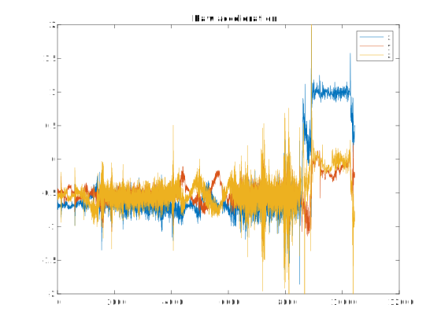

# AHRS

This repository contains implementations of AHRS filters in C++ for sensor fusion applications. The code takes an acceleration signal with an unknown orientation and rotates it so that the gravity value yields a positive value in the z-axis for the NED (North-East-Down) frame and a negative value in the z-axis for the ENU (East-North-Up) frame. Essentially, what this means is that the code is able to orient the acceleration signal in such a way that the direction of gravity is easy to identify.

> An attitude and heading reference system (AHRS) consists of sensors on three axes that provide attitude information for aircraft, including roll, pitch, and yaw.
> [https://en.wikipedia.org/wiki/Attitude_and_heading_reference_system][1]

## Complementary Filter

This respository includes a Complementary filter, which is a sensor fusion algorithm used to combine data from multiple sensors with different characteristics. It is based on the idea of using a low-pass filter and a high-pass filter in parallel to achieve a good balance between filtering out noise and preserving the responsiveness of the system.

The low-pass filter is used to remove high-frequency noise from the sensor data, while the high-pass filter is used to remove low-frequency drift. The output of the Complementary filter is a combination of the low-pass filtered data and the high-pass filtered data, resulting in a signal that is both stable and responsive.

This process is easier to understand than other filtering methods. By rotating the signal, the code is able to eliminate noise and adjust for the direction of gravity, which can then be used to determine the orientation of the device.

Moreover, this filtering method is less computationally intensive compared to other methods that require complex algorithms and computations.

### Implementation

The Complementary filter in this repository is implemented in C++, with a simple class structure. The class takes in three input signals, a gyroscopic signal, an accelerometer signal, and a magnetic field signal, and outputs a fused signal that represents the orientation of the device in space.

The code includes example usage in the `main.cpp` file.

### Getting Started

To use the Complementary filter in your own project, include the `filter/ComplementaryFilter.h` header file in your source code.

### Example

## Dependencies

This implementation requires a C++17-compliant compiler.

## License

Copyright (c) 2023 William Grand

Permission is hereby granted, free of charge, to any person obtaining a copy of this software and associated documentation files (the “Software”), to deal in the Software without restriction, including without limitation the rights to use, copy, modify, merge, publish, distribute, sublicense, and/or sell copies of the Software, and to permit persons to whom the Software is furnished to do so, subject to the following conditions:

The above copyright notice and this permission notice shall be included in all copies or substantial portions of the Software.

THE SOFTWARE IS PROVIDED “AS IS”, WITHOUT WARRANTY OF ANY KIND, EXPRESS OR IMPLIED, INCLUDING BUT NOT LIMITED TO THE WARRANTIES OF MERCHANTABILITY, FITNESS FOR A PARTICULAR PURPOSE AND NONINFRINGEMENT. IN NO EVENT SHALL THE AUTHORS OR COPYRIGHT HOLDERS BE LIABLE FOR ANY CLAIM, DAMAGES OR OTHER LIABILITY, WHETHER IN AN ACTION OF CONTRACT, TORT OR OTHERWISE, ARISING FROM, OUT OF OR IN CONNECTION WITH THE SOFTWARE OR THE USE OR OTHER DEALINGS IN THE SOFTWARE.

[1]: https://en.wikipedia.org/wiki/Attitude_and_heading_reference_system